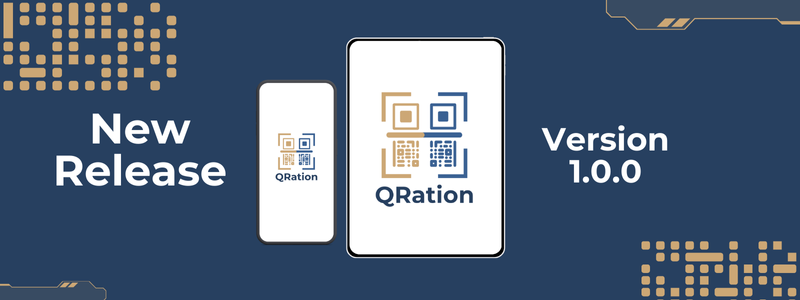
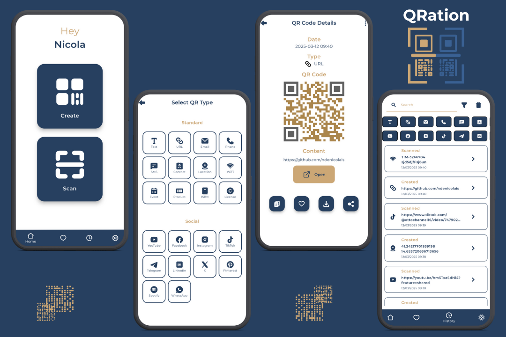

## 🔶 Authors
- [@ndn21](https://github.com/ndenicolais)

## 📄 Description

This app allows you to scan and generate QR codes, which can be saved in your personal account for easy and safe management. You can access all saved QR codes at any time. In addition, each code allows a different function to be performed according to its type.

## 💎 Release

App release 1.0.0 is available for download. You can download it from the following link:

[Download v1.0.0](https://github.com/ndenicolais/QRation/releases/download/v1.0.0/QRation_v1.0.0.apk)

## 🔑 Features
- Login via Google or email & password
- Data storage with Firestore Database
- Image storage with Supabase Storage
- Responsive design for all screens with ScreenUtil
- Navigation with transition effects with Get
- Light and dark theme variants
- English and Italian languages variants
- Custom colors for code creation
- Filter to search for a specific code based on its type
- History of all codes scanned and created
- Download or share each code
- Generation of a PDF, Excel and CSV files of the entire database
- Database export and import in JSON format

## 🎨 Screenshots

## 📌 Packages
Below is a list of some of the most relevant packages:
- [get](https://pub.dev/packages/get)
- [flutter_screenutil](https://pub.dev/packages/flutter_screenutil)
- [google_fonts](https://pub.dev/packages/google_fonts)
- [cloud_firestore](https://pub.dev/packages/cloud_firestore)
- [intl](https://pub.dev/packages/intl)
- [provider](https://pub.dev/packages/provider)
- [shared_preferences](https://pub.dev/packages/shared_preferences)
- [mobile_scanner](https://pub.dev/packages/mobile_scanner)
- [qr_flutter](https://pub.dev/packages/qr_flutter)
