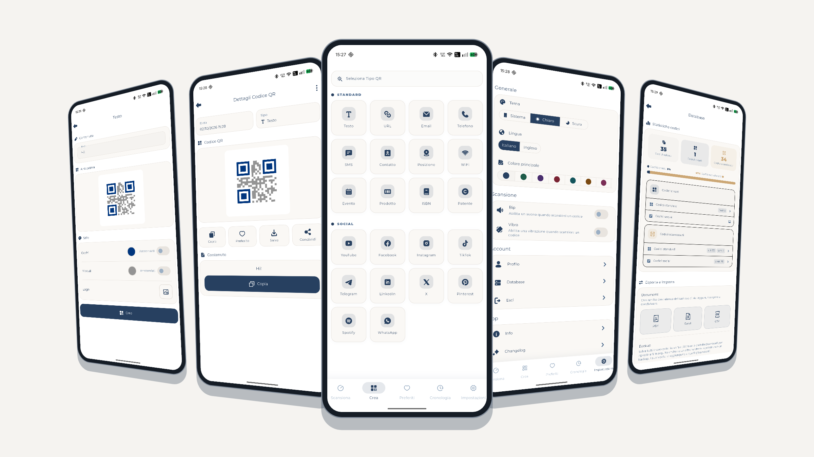
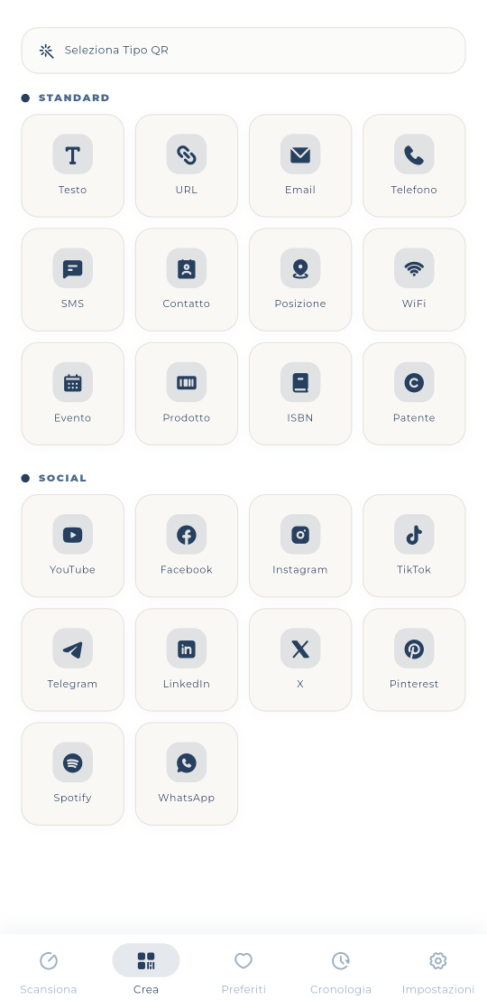
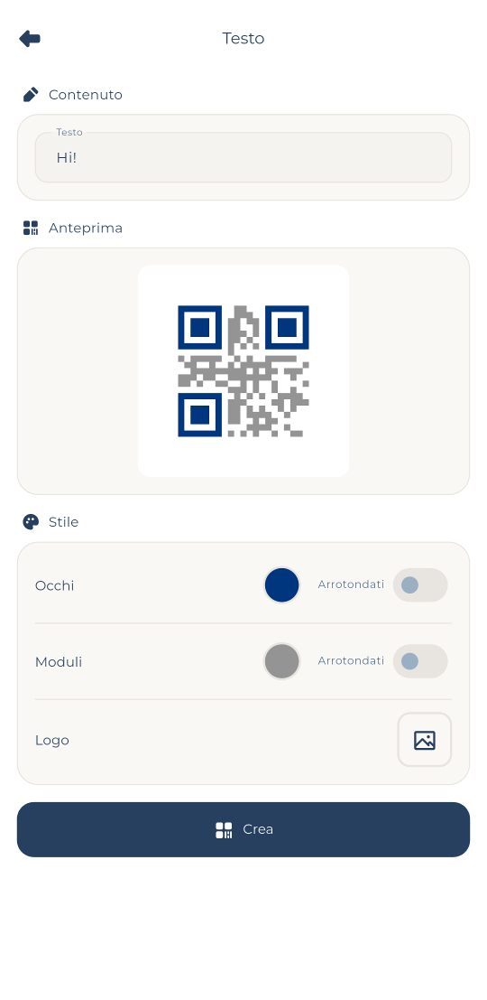
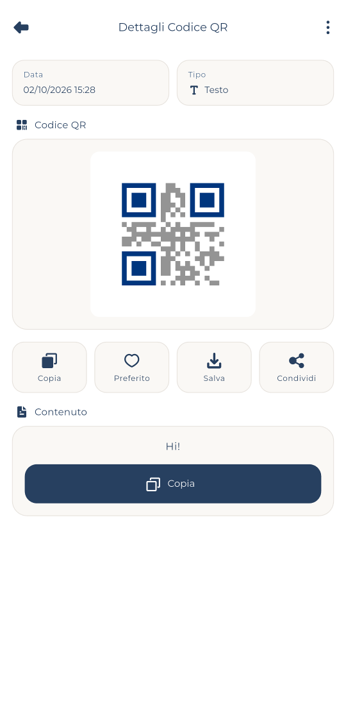
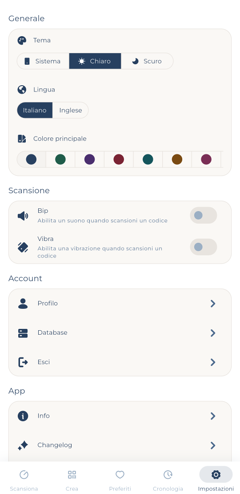
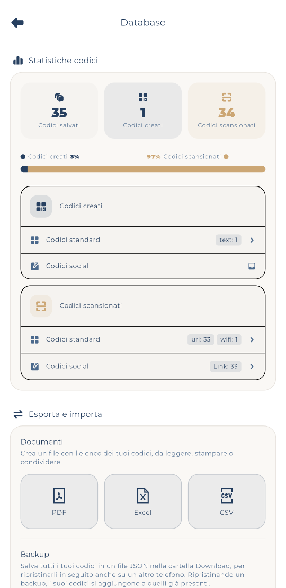

<div align="center">


# QRation

**A QR code and barcode scanner and creator for Android, built with Flutter.**

Scan codes with the camera or from an image, create custom QR codes for 12 standard types and 10 social networks,<br>
keep everything synced in the cloud, export to PDF, Excel or CSV — in Italian and English, with light and dark themes.

[](https://github.com/ndenicolais/QRation/releases/latest)
[](#requirements)
[](https://flutter.dev)
[](LICENSE)

[**📥 Download the APK**](#download) · [Features](#features) · [Documentation](DOCUMENTATION.md) · [Privacy](PRIVACY.md)

<br>



</div>

---

## Screenshots

| Create | QR editor | Code details | Settings | Database |
|:---:|:---:|:---:|:---:|:---:|
|  |  |  |  |  |

---

## Features

| | |
|---|---|
| 📷 **Scanner** | Scan QR codes and barcodes with the camera or from an image in the gallery, with optional beep and vibration |
| ✏️ **QR creation** | Text, URL, email, phone, SMS, contact, location, Wi-Fi, calendar event, product, ISBN and driving licence |
| 💬 **Social QR** | YouTube, Facebook, Instagram, TikTok, Telegram, LinkedIn, X, Pinterest, Spotify and WhatsApp |
| 🎨 **Customization** | Colors and rounded corners for eyes and modules, plus a custom logo, with a live preview |
| 🔎 **Code details** | Copy, share, save to the gallery, open or delete every code |
| 🕑 **History** | Every code in one list, with text search and filters by type, social network and source |
| ❤️ **Favorites** | Mark your favorite codes and find them by tab (scanned / created) |
| 📊 **Database** | Statistics on created and scanned codes, by type |
| 📄 **Export** | Export your codes to PDF, Excel or CSV |
| 💾 **JSON backup** | Save all your codes to a JSON file and restore them, even on another phone |
| 🔐 **Authentication** | Sign in with a Google account or email and password, manage your profile or delete your account |
| ☁️ **Sync** | All codes are stored on Cloud Firestore and synced across sessions |
| 🌍 **Multilingual** | Italian and English |
| 🌗 **Theme** | System / Light / Dark theme and a choice of accent colors |

---

## Download

<a href="https://github.com/ndenicolais/QRation/releases/download/v2.0.0/QRation_v2.0.0.apk"></a>

QRation is distributed as an APK on [GitHub Releases](https://github.com/ndenicolais/QRation/releases), not on the Play Store. It needs Android 7.0+ on a 64-bit (arm64) device with Google Play services.

1. Download the APK on your phone and open it.
2. If asked, allow your browser or file manager to **install unknown apps**.
3. Confirm the installation.

> [!NOTE]
> **"App blocked to protect your device" (Google Play Protect).** Play Protect shows this warning for apps that are not distributed through the Play Store and whose developer it does not know yet. Tap **More details → Install anyway** to continue. The source code of every release is available in this repository.

> [!IMPORTANT]
> **Updating from QRation 1.x:** releases are now signed with a new key, so Android cannot update the old app in place. Uninstall the previous version first, then install the new APK. Your collection is stored in the cloud and comes back as soon as you sign in.

---

## Architecture

| Layer | Technology |
|---|---|
| Framework | Flutter 3 / Dart |
| State management | GetX |
| Cloud database | Cloud Firestore |
| Authentication | Firebase Auth + Google Sign In |
| Crash reporting | Firebase Crashlytics |
| Local persistence | SharedPreferences |
| QR scanning | mobile_scanner |
| QR generation | pretty_qr_code |
| Fonts | Montserrat (bundled) |
| Icons | MingCute Icons, Line Awesome |
| Maps | flutter_map |
| Export | pdf, excel, csv, share_plus, image_gallery_saver_plus |

<details>
<summary><b>Project structure</b></summary>

```
lib/
├── main.dart                  # Entry point
├── app.dart                   # QrationApp (GetMaterialApp, routing, localization)
├── core/
│   ├── constants/             # Global constants (barcode types, social list, URIs)
│   ├── routes/                # Named routes (app_routes, app_pages)
│   ├── theme/                 # Theme, colors, ThemeController
│   ├── utils/                 # Utilities (icons/labels per code type, validators)
│   └── widgets/               # Shared widgets
├── features/
│   ├── auth/                  # Login, signup, reset password, AuthController, SessionStore
│   ├── codes/                 # Scanner, QR creation, details, models, CodesService
│   ├── export/                # CSV, Excel and PDF services
│   ├── favorites/             # Favorites screen
│   ├── history/               # Code history
│   ├── home/                  # Home and bottom navigation
│   ├── onboarding/            # First-launch onboarding
│   ├── settings/              # Settings, database, info, privacy policy, support
│   ├── splash/                # Splash screen
│   ├── user/                  # User profile, account deletion
│   └── welcome/               # Welcome screen
└── l10n/                      # ARB localization files (en, it)
```

</details>

---

## Build from source

### Requirements

- Flutter SDK 3.24 or later (Dart SDK 3.5.2 or later)
- Android 7.0+ (API 24+), 64-bit (arm64), with Google Play services
- Internet connection (for authentication and Firestore sync)
- A configured `android/app/google-services.json` file (Firebase Auth + Firestore)
- Firestore security rules that let each user access only `users/{uid}` and its `codes` subcollection, with Storage closed (see [DOCUMENTATION.md §14](DOCUMENTATION.md#14-regole-di-sicurezza-firebase))

### Run

```bash
# Clone the repository
git clone https://github.com/ndenicolais/QRation.git
cd QRation

# Install dependencies
flutter pub get

# Run the app
flutter run
```

---

## Documentation

For detailed documentation of every feature, data model, screen and technical choice, see [DOCUMENTATION.md](DOCUMENTATION.md). How personal data is handled is described in the [privacy policy](PRIVACY.md), also available in the app under *Settings > Info > Privacy Policy* and [online](https://ndenicolais.github.io/qration/privacy/).

---

## License

Copyright © 2026 Nicola De Nicolais — All rights reserved.
Released under a **source-available, non-commercial** license — see [LICENSE](LICENSE) for details.
Commercial use, including publishing on any app store, requires the author's written permission.

<div align="center">

Made by **Nicola De Nicolais** · [ndn21dev@gmail.com](mailto:ndn21dev@gmail.com) · [GitHub](https://github.com/ndenicolais)

</div>
